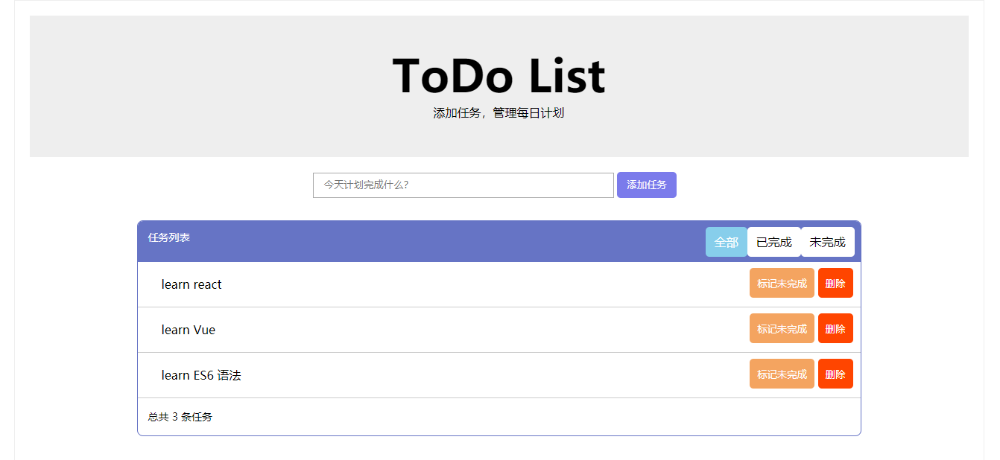

# Vue-ToDo-List

## 项目介绍
> vuejs实现简单的todolist效果

## DEMO

https://geeklhj.gitee.io/react_router_pages/

## 安装教程

git clone https://github.com/Geek-LHJ/Vue-practice-code

cd vuejs-TODOList-homework # 由于没有这个仓库包含多个项目文件

npm install

## 使用说明

npm start

在浏览器里面输入下面端口并打开：http://localhost:8080/

运行效果截图:

